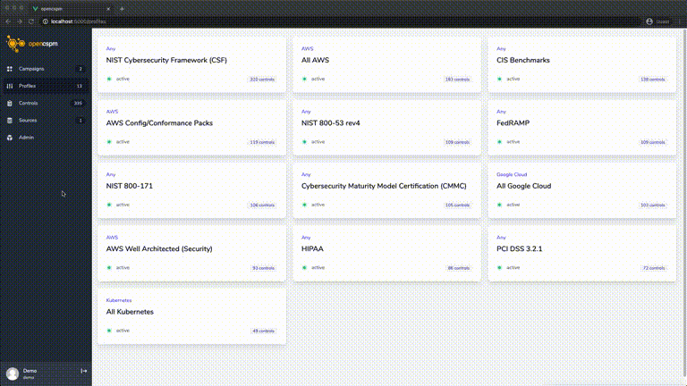
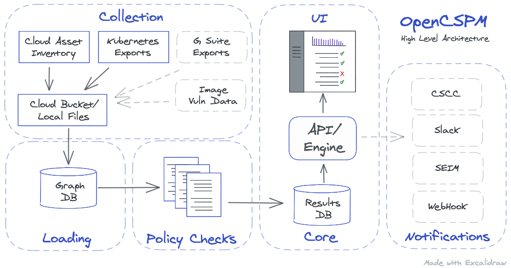
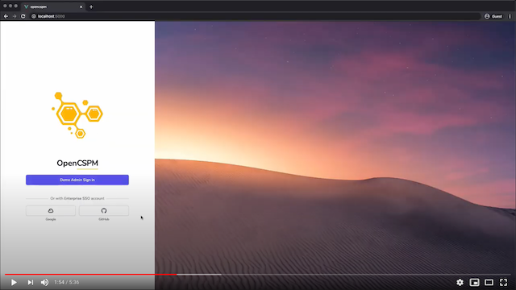

# OpenCSPM
Open Cloud Security Posture Management, OpenCSPM, is an open-source platform for gaining deeper insight into your cloud configuration and metadata to help understand and reduce risk over time.

## Who is OpenCSPM for?

* Security teams running infrastructure in cloud environments looking to gain visibility into security risk across the entire account and track the resolution of those issues.
* Development and Infrastructure teams looking for a set of security best-practices to follow as they develop new systems and bake security in early and often.
* Red Teams wanting to create targeted scenarios specific to their environment with the highest impact and benefit to their Blue Team.
* Any organization looking to establish a baseline of security issues, prioritize them by risk, and track them to closure over time.

## What does OpenCSPM do?

When deployed inside your environment, it can:

1. collect several types of cloud configuration data on a one-time or recurring basis from your cloud account resources (VMs, Clusters, IAM, etc),
2. parse and load that data into a graph database with deep linked relationships between resources to support advanced querying capabilities,
3. run a customizable series of policy checks to determine conformance and record passing/failing resources on a recurring basis,
4. create custom groupings of related policy checks that aid in tracking remediation efforts and reduction in risk over time,
5. and provide notifications when deviations from desired baselines occur to multiple destinations.

### High-level Architecture

OpenCSPM has several key components that work together:

1. Structured configuration and metadata is collected from the GCP Cloud Asset Inventory and Kubernetes API to a Storage Bucket or local filesystem.
2. The data is parsed and loaded into a Graph Database with complex relationships intact.
3. One or more customizable sets of policy checks ("control packs") are run against the parsed inventory data, and results are stored.
4. The API/Engine serves up the user interface, handles tracking of campaigns, and notifications.

## Getting Started

Ready to get going?  Follow the [instructions for getting started](site/getting_started.md) or watch the following getting started video:

## Support and Community

OpenCSPM is undergoing active development and community assistance is available via the [OpenCSPM Slack Channel](https://join.slack.com/t/opencspm/shared_invite/zt-j5zsp2mr-Z_lMoYosTXev4lWN8Q~~mA).  If you have found an issue, please file it using a GitHub [issue](https://github.com/opencspm/opencspm/issues/new/choose).

## Contributing

We invite you to submit requests for new features and bug reports using a Github [issue](https://github.com/opencspm/opencspm/issues/new/choose). If you would like to contribute to OpenCSPM, please review our [development guide](site/development.md).

## Creators

OpenCSPM was made open-source software by [Josh Larsen](https://github.com/joshlarsen) and [Brad Geesaman](https://github.com/bgeesaman), the co-founders of [Darkbit](https://darkbit.io). Darkbit is a cloud-native security assessment consulting firm based in the US that helps organizations understand the risks in their cloud and Kubernetes resource configurations.
